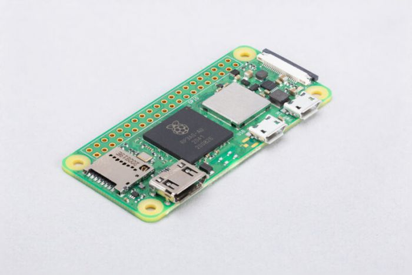

# Pi-Iot
## Beschrijving
Meten en opvolgen van het energieverbruik en opbrengst is gloeiend actueel. Dit geldt zowel voor thuis als op afstand zoals tweede verblijf. 

Dit project implementeerd een *framework* voor ***energy analyse*** gebaseerd op een Raspberry ***Pi-Iot*** oplossing. Het kreeg als bijnaam 'Pilot'.
## Bronnen
Eén van de economische gevolgen van de COVID-19-pandemie zijn de stijgende energieprijzen van elektriciteit en gas. Sinds enige tijd hou ik mijn meterstanden(elektriciteit, gas, zonnepanelen, water, auto) bij in de ***[EnergieID](https://app.energyid.eu)*** web/app.  

Binnen de scope van dit project moeten volgende doeleinden geimplementeerd worden: 
- [ ] Een notificatie op begin van de maand herinnert mij eraan om deze meters af te lezen op specifieke teller of app en manueel in te voeren. Voor meters op afstand zou dit geautomatiseerd moeten worden door de gegevens iedere 15min door te sturen. 
- [ ] Door het invoeren van een slimme thermostaat kan het gasverbruik voor de verwarming geoptimaliseerd worden. Dit moet verder verfijnt worden door de nachtstand van de verwarming te activeren om 22:00.
- [ ] De status van de Raspberry Pi(on/off-line, on/off-power) voor thuis en op afstand moet kunnen opgevolgd worden d.m.v. iOS app(Home Assistent, Tuya Smart Life). 
- [ ] Notificaties worden naar iOS IFTTT app en Smartwatch gestuurd. 
## Hardware
De implementatie vereist 2 Raspberry Pi boards: 
1. *Raspberry Pi 2 Model B Rev 1.1:* installatie thuis. 
2. *Raspberry Pi Zero 2 W:* installatie op afstand.

Aangezien hardware levering een probleem is in deze pandemie periode zal ik terugvallen op de beschikbare Raspberry Pi Model B Rev 1.1 voor zowel de installatie thuis als op afstand. Zodra de Raspberry Pi Zero 2W terug beschikbaar is zal de installatie op afstand hiernaar gemigreerd worden. 
## Software
Dit project zal geimplementeerd worden op de meest recente ***Bullseye Raspberry Pi OS***. 
1. Schakel energiebesparende scherm functies uit. Dit is noodzakelijk bij gebruik in het leslokaar. Anders blokkeert het scherm en is een reboot noodzakelijk. Raadpleeg de [log file](Logs/Energiebesparende_functies_logfile.txt) voor meer details. 

2. Installatie [Home Assistant](https://www.home-assistant.io): 
   * Hierbij volg ik de instructies uit de cursus *RASPBERRY Pi - DEEL 1(5.c Domotica)*. Raadpleeg de [log file](Logs/Home_Assitant_logfile.txt) voor meer details. 
     * Home Assistant openen met Raspberry Chromium browser op [URL](http://RPIDanUyt.local:8123). 
       - [ ] Herstarten van Home Assistant server lukt niet. 
   * [Tuya integratie](https://www.home-assistant.io/integrations/tuya) van alle *Powered by Tuya* apparaten die toegevoegd zijn aan de *Tuya Smart* app. 
     * Tuya Cloud *Pi-Iot* project.

```ruby
# Debug logger voor MQTT
logger:
  default: warning
  logs:
    homeassistant.components.mqtt: debug
```

   * [Spotify integratie](https://www.home-assistant.io/integrations/spotify/) d.m.v. manuele configuratie via *Spotify Application*. Automatische discovery wordt afgebroken t.g.v. probleem met callback URI. 
   * [Raspberry Pi Power Supply Checker](https://www.home-assistant.io/integrations/rpi_power). 
      - [ ] ***Hoe gebeurd de configuratie? Geen entry in de */home/homeassistant/.homeassistant/configuration.yaml* file.***

```ruby
/home/homeassistant/.homeassistant/configuration.yaml
# Configure a default setup of Home Assistant (frontend, api, etc)
default_config:
# Text to speech
tts:
  - platform: google_translate
# Automatisering
automation: !include automations.yaml
# Scripts
script: !include scripts.yaml
# Scenes
scene: !include scenes.yaml
# Add Spotify Daniel Free
spotify:
  client_id: YOUR_CLIENT_ID
  client_secret: YOUR_CLIENT_SECRET
# Brother Printer
template:
  - binary_sensor:
    - name: 'Brother Printer status: lade nazien '
      state: >
        {{ is_state('sensor.<YOUR_PRINTER>_status', 'lade nazien [lade #1]') }}
# Python Scripts
python_script:
# Logger
logger:
  default : warning
```

3. Connecteer Raspberry Pi Model B Rev 1.1 met de *Tuya Smart Life* app [Connect a Raspberry Pi to the Cloud Using Link SDK](https://developer.tuya.com/en/demo/link-sdk-demo-raspberry-pi). Raadpleeg de [log file](Logs/Pi-Iot_BEK38_logfile.txt) voor meer details. 
   * Tuya product *Pi-Iot BEK38*.
      - [ ] ***MQTT protocol. Notificatie indien device offline is.***

4. In de YouTube video staan commando's die moeten uitgevoerd worden vóór de installatie. De reacties op de video bevatten eveneens extra informatie of aanpassingen: Op YouTube is er een video over [How to Detect Power & Internet Outages With My Raspberry Pi Python Project](https://www.youtube.com/watch?v=Tj0mNO3ZDao/) die als referentie zal gebruikt worden. 

```
sudo apt update
sudo apt full-upgrade
# installeer Python 3 virtuele omgeving specifiek voor onze applicatie
sudo apt-get install python3-venv
# installatie directory
mkdir RPI-GF
cd RPI-GF
# creatie virtuele omgeving
python3 -m venv GF
# activeer virtuele omgeving
. GF/bin/activate
```

Hierna wordt de installatie verder gezet op basis van [Outage-Detector](https://github.com/fabytm/Outage-Detector/) gelinkt aan het YouTube referentie video. 
>Noteer eveneens welke aanpassingen je aan welke configuratiebestanden je hebt doorgevoerd.
## Eigen scripts en programma's
>Sla je aparte bestanden op in deze repository.

## Uitbreidingen
1. Wifi repeater geconfigureerd als router van wlan0(ingebouwde interface) naar wlan1(USB-C dongle). Encryptie WPA2 met een nieuwe SSID(verborgen):
   * Als leidraad kun je de instructies uit de cursus *RASPBERRY Pi - DEEL 1(4.f Wireless Access Point)* gebruiken. 
   * Dit is enkel een optie voor de *Raspberry Pi Zero 2W* aangezien de *Pi 2 model B Rev 1.1* geen ingebouwde Wifi heeft. 
>Noteer hier uitbreidingen die na de implementatie van de initiële scope zullen behandeld worden. 
## Afbeeldingen
1.  Raspberry Pi 2 Model B Rev 1.1:


2. Raspberry Pi Zero 2 W:



## Nuttige commando's
| Command | Description |
| --- | --- |
| cat /proc/device-tree/model | Geef het PI model weer |
| ip addr | show addresses to network interfaces |
| man -k | manual page keyword |
| python -- | Python versie |
| sudo systemctl status home-assistant@homeassistant -l | Home Assistant status |
