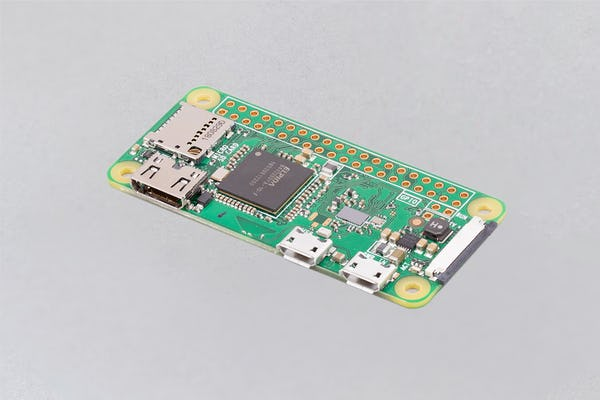

# RPI-Gone-Fishing
## Beschrijving
Supervisie van een verblijfplaats is ingeburgerd via commerciële oplossingen gebaseerd op o.a. internet deurbel, ip camera, Wifi vermogen meter. 

Deze zijn afhankelijk van de aanwezigheid van netstroom(voor voeding van de apparaten) en een werkend internet(voor toegang op afstand) op deze locaties. 

Dit project implementeerd een *prototype* voor ***Netstroom & Internet onderbreking*** gebaseerd op een ***Raspberry Pi***.
## Bronnen
Tijdens de 2021 overstromingen in de Ardennen werden we geconfronteerd met de beperkingen van de huidige installatie. Noodgedwongen waren we verplicht onze verblijfplaats te verlaten toen deze getroffen werd. 

Zowel de elektriciteit en internet werden uitgeschakeld uit veiligheid. Hierdoor was het niet meer mogelijk om op afstand de geinstalleerde infrastructuur te bereiken. 

Op YouTube is er een video over [How to Detect Power & Internet Outages With My Raspberry Pi Python Project](https://www.youtube.com/watch?v=Tj0mNO3ZDao/) die als referentie zal gebruikt worden. 
## Hardware
Aangezien hardware levering een probleem is in deze pandemie periode zal ik terugvallen op de beschikbare [Raspberry Pi 2 Model B Rev 1.1](Images/raspberry-pi-2-model-b-v11-1gb-ram.jpg).
- Eenmaal het prototype op punt staat, is het de bedoeling om over te schakelen naar de Raspberry Pi Zero W. Dit maakt echter geen deel uit van dit project. 

Zodra hardware terug beschikbaar is kunnen volgende uitbreidingen overwogen worden: 
1. [4G/3G/2G/GSM/GPRS/GNSS HAT](Images/Raspberry_PI_LTE.png) om tijdelijk over te schakelen naar mobiel data GSM netwerk indien internet via vast ethernet weggevallen is. Als alternatief zal ondertussen de beschikbare [Huawei E8372h-153 - 4G Dongle](Images/Huawei_E8372h-153-4G_Dongle.png) in combinatie met de [SONY UWA-BR100 USB Wi-Fi adapter](Images/SONY_USB_Wifi.jpg) gebruikt worden. 
2. [Uninterruptible Power Supply(UPS) HAT](Images/PiJuice_HAT.png) om 5V voeding tijdelijk te voorzien indien de netspanning weggevallen is.
## Software
Dit project zal geimplementeerd worden op de meest recente ***Bullseye Raspberry Pi OS.***

In de YouTube video staan commando's die moeten uitgevoerd worden vóór de installatie. De reacties op de video bevatten eveneens extra informatie of aanpassingen:

```
sudo apt update
sudo apt full-upgrade
# installeer Python 3 virtuele omgeving specifiek voor onze applicatie
sudo apt-get install python3-venv
# installatie directory
mkdir RPI-GF
cd RPI-GF
# creatie virtuele omgeving
python3 -m venv GF
# activeer virtuele omgeving
. GF/bin/activate
```
Hierna wordt de installatie verder gezet op basis van [Outage-Detector](https://github.com/fabytm/Outage-Detector/) gelinkt aan het YouTube referentie video. 

>Noteer eveneens welke aanpassingen je aan welke configuratiebestanden je hebt doorgevoerd.
## Eigen scripts en programma's
Overzicht van de taaklijst: 
- [ ] Notificatie via email. 
- [ ] Notificatie via [IFTTT ](https://ifttt.com/?utm_medium=Email&utm_source=Customerio&utm_campaign=User_Template&utm_term=IFTTT_Logo&utm_content=). Verschillende values voor een power of internet outage. 
- [ ] Automatische failover naar mobiel data GSM network indien internet via vast ethernet weggevallen is. 

Open issue's:
- [ ] Hoe maak je een pip3 deployment package op basis van je eigen code. 
- [ ] uhubctl gebruiken om USB poorten te (des)-activeren. 
- [ ] Hoe kan [Home Assistant](https://www.home-assistant.io) een uitbreiding zijn?
- [ ] Kun je een Raspberry Pi in sleep mode zetten om batterij te sparen? Is er dan ook een awake functionaliteit.
- [ ] [HomeWizard Energy vermogenmeter(HWE-SDM230) lokale API](https://energy.homewizard.net/nl/support/solutions/articles/19000117051-homewizard-energy-lokale-api). 
'''
import requests

# Basic information
response=requests.get('http://192.168.36.151/api')

print("Basic information:")
print(response.text)

#Recent measurement
response=requests.get('http://192.168.36.151/api/v1/data')

print("Recent measurement:")
print(response.text)
'''
>Sla je aparte bestanden op in deze repository.
## Afbeeldingen
1.  Raspberry Pi 2 Model B Rev 1.1:


2. Huawei E8372h-153 - 4G Dongle:


3. SONY UWA-BR100 USB Wi-Fi adapter: 


4. 4G/3G/2G/GSM/GPRS/GNSS HAT voor Raspberry Pi - LTE CAT4:


5. PiJuice HAT - A portable Power Platform for Every Raspberry Pi:


6. Raspberry Pi Zero W:



## Nuttige commando's
| Command | Description |
| --- | --- |
| cat /proc/device-tree/model | Geef het PI model weer |
| python -- | Python versie |
