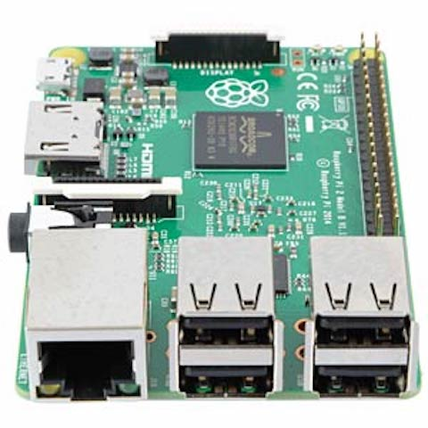
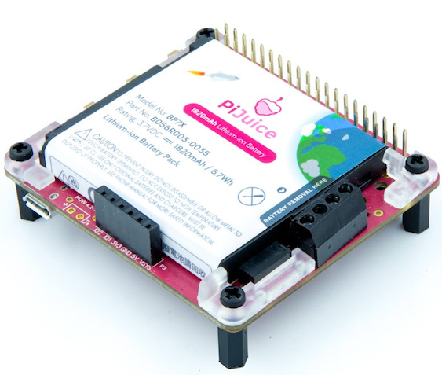
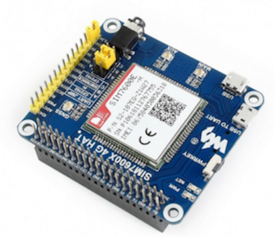

# RPI-Gone-Fishing
## Beschrijving
Bewaking van een hoofdverblijfplaats of buitenverblijf is ingeburgerd via commerciële oplossingen gebaseerd op internet deurbel, ip camera's ...

Deze zijn afhankelijk van de aanwezigheid van netspanning(voor voeding van de apparaten) en een werkend internet(voor toegang op afstand) op deze locaties. 

Dit project implementeerd een ***monitoring van netspanning en internet*** gebaseerd op een ***Raspberry Pi***.
## Bronnen
Inspiratie heb ik helaas opgedaan tijdens de overstromingen in de Ardennen afgelopen jaar. Noodgedwongen waren we verplicht de camping te verlaten toen deze getroffen werd. 

Zowel de elektriciteit en internet werden uitgeschakeld uit veiligheid. Hierdoor was het niet meer mogelijk om op afstand de geinstalleerde ip camera te bereiken. 

Op YouTube is er een video over [How to Detect Power & Internet Outages With My Raspberry Pi Python Project](https://www.youtube.com/watch?v=Tj0mNO3ZDao/) die als referentie zal gebruikt worden. 
## Hardware
Aangezien hardware levering een probleem is in deze pandemie periode zal ik terugvallen op de beschikbare ***Raspberry Pi 2 Model B Rev 1.1***.

Zodra hardware terug beschikbaar is kunnen volgende uitbreidingen overwogen worden: 
1. [Uninterruptible Power Supply(UPS) HAT](Images/PiJuice_HAT.png) om 5V voeding tijdelijk te voorzien indien de netspanning weggevallen is.
2. [4G/3G/2G/GSM/GPRS/GNSS HAT](Images/Raspberry_PI_LTE.png) om tijdelijk over te schakelen naar mobiel data GSM netwerk indien internet via vast ethernet weggevallen is. 
* gg
## Software
Als basis voor de software zal de GitHub Python source [Outage-Detector](https://github.com/fabytm/Outage-Detector/) gelinkt aan het YouTube referentie project gebruikt worden. 

Deze zal geimplementeerd worden op de meest recente ***Bullseye Raspberry Pi OS.*** 

*Noteer eveneens welke aanpassingen je aan welke configuratiebestanden je hebt doorgevoerd.*
### Eigen scripts en programma's
*Sla je als apparte bestanden op in deze repository.*
## Afbeeldingen toevoegen
1.  Raspberry Pi 2 Model B Rev 1.1:

2. PiJuice HAT - A portable Power Platform for Every Raspberry Pi:

3. 4G/3G/2G/GSM/GPRS/GNSS HAT voor Raspberry Pi - LTE CAT4

