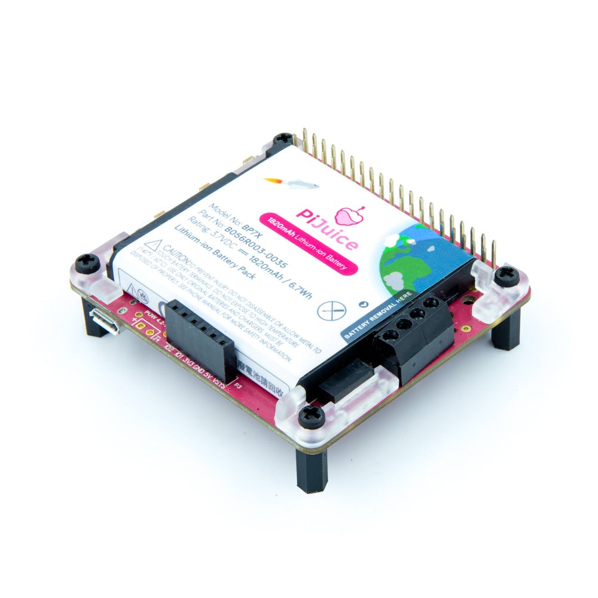
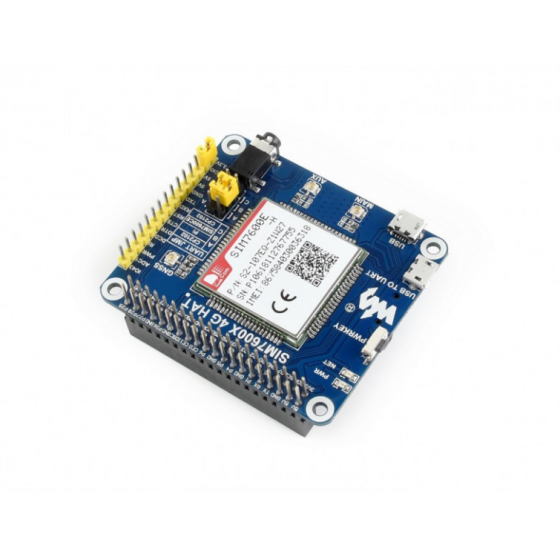

# Raspberry-Pi-Cursus-Project
## Beschrijving
Bewaking van de hoofdverblijfplaats of buitenverblijf is ingeburgerd via commerciële oplossingen gebaseerd op internet deurbel, ip camera's ...

Deze zijn afhankelijk van de aanwezigheid van netspanning(voor voeding van de apparaten) en een werkend internet(voor toegang op afstand) op deze locaties. 

Dit project implementeerd een **monitoring van netspanning en internet** gebaseerd op een Raspberry Pi.
## Bronnen
Noteer hier uw inspiratie, hardware en software bronnen. 
## Hardware
Noteer hier welke hardware je gebruikt. 
## Software
Noteer hier welke software je gebruikt. 
Noteer eveneens welke aanpassingen je aan welke configuratiebestanden je hebt doorgevoerd. 
### Eigen scripts en programma's
Sla je als apparte bestanden op in deze repository. 
## Afbeeldingen toevoegen

