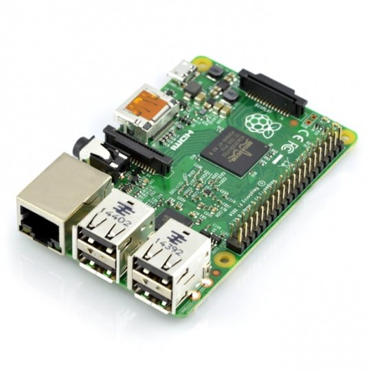

# Pi-Iot
## Beschrijving
Meten en opvolgen van het energieverbruik en opbrengst is gloeiend actueel. Dit geldt zowel voor thuis als op afstand zoals tweede verblijf. 

Dit project implementeerd een *framework* voor ***energy analyse*** gebaseerd op een Raspberry ***Pi-Iot*** oplossing. Het kreeg als bijnaam 'Pilot'.
## Bronnen
Eén van de economische gevolgen van de COVID-19-pandemie zijn de stijgende energieprijzen van elektriciteit en gas. Sinds enige tijd hou ik mijn meterstanden(elektriciteit, gas, zonnepanelen, water, auto) bij in de ***[EnergieID](https://app.energyid.eu)*** web/app.  

Binnen de scope van dit project moeten volgende doeleinden geimplementeerd worden: 
- [ ] Een notificatie op begin van de maand herinnert mij eraan om deze meters af te lezen op specifieke teller of app en manueel in te voeren. Voor meters op afstand zou dit geautomatiseerd moeten worden door de gegevens iedere 15min door te sturen. 
- [ ] Door het invoeren van een slimme thermostaat kan het gasverbruik voor de verwarming geoptimaliseerd worden. Dit moet verder verfijnt worden door de nachtstand van de verwarming te activeren om 22:00.
- [ ] De status van de Raspberry Pi(on/off-line, on/off-power) voor thuis en op afstand moet kunnen opgevolgd worden d.m.v. iOS app(Home Assistant, Tuya Smart Life). 
  * YouTube video [How to Detect Power & Internet Outages With My Raspberry Pi Python Project](https://www.youtube.com/watch?v=Tj0mNO3ZDao/) wordt als referentie gebruikt. Hierin staan commando's die moeten uitgevoerd worden vóór de installatie. De reacties op de video bevatten eveneens extra informatie of aanpassingen. Hierna wordt de installatie verder gezet op basis van [Outage-Detector](https://github.com/fabytm/Outage-Detector/) gelinkt aan het YouTube referentie video. 

  ```ruby
  sudo apt update
  sudo apt full-upgrade
  # installeer Python 3 virtuele omgeving specifiek voor onze applicatie
  sudo apt-get install python3-venv
  # installatie directory
  mkdir RPI-GF
  cd RPI-GF
  # creatie virtuele omgeving
  python3 -m venv GF
  # activeer virtuele omgeving
  . GF/bin/activate
  ```
  
- [ ] Notificaties worden naar iOS Tuya Smart Life/IFTTT app en Smartwatch gestuurd. 
## Hardware
De implementatie vereist 2 Raspberry Pi boards: 
1. *Raspberry Pi 2 Model B Rev 1.1:* installatie thuis. 
2. *Raspberry Pi Zero 2 W:* installatie op afstand.
     * Aangezien hardware levering een probleem is in deze pandemie periode zal ik terugvallen op de beschikbare *ESP8266 Wemos D1 mini en Arduino IDE*. Zodra de Raspberry Pi Zero 2W terug beschikbaar is zal de installatie op afstand hiernaar gemigreerd worden. 
## Software
>**Raspberry Pi 2 Model B Rev 1.1: installatie thuis**

Dit project zal geimplementeerd worden op de meest recente ***Bullseye Raspberry Pi OS***. 
1. Configureer een remote connectie met *RealVNC Viewer*:
   * Hierbij volg ik de instructies uit de cursus *RASPBERRY Pi - DEEL 1(3.d Netwerktoegang)*. 
     * Link de VNC Connect account via *Licensing* met de Raspberry Pi voor connectiviteit buiten het lokale netwerk. 
2. Schakel energiebesparende scherm functies uit. Dit is noodzakelijk bij gebruik in het leslokaar. Anders blokkeert het scherm en is een reboot noodzakelijk. Raadpleeg de [log file](Logs/Energiebesparende_functies_logfile.txt) voor meer details. 

3. Installatie [Home Assistant](https://www.home-assistant.io): 
   * Hierbij volg ik de instructies uit de cursus *RASPBERRY Pi - DEEL 1(5.c Domotica)*. Raadpleeg de [log file](Logs/Home_Assitant_logfile.txt) voor meer details. 
     * Home Assistant openen met Raspberry Chromium browser op [URL](http://RPIDanUyt.local:8123).
       - *Beperking:* Home Assistant app remote toegang is enkel mogelijk via Home Assistant Cloud abonnement. 
       - [ ] Herstarten van Home Assistant server lukt niet.
   * [Tuya](https://www.home-assistant.io/integrations/tuya) integratie van alle *Powered by Tuya* apparaten die toegevoegd zijn aan de *Tuya Smart* app. 
     * Tuya Cloud *Pi-Iot* project. Automatische discovery Tuya waarin volgende gegevens moeten ingevoerd worden:
     
     ```ruby
     - Tuya IoT Access ID
     Ga naar je cloud project op Tuya IoT Platform. Access ID vind je onder Authorization Key in het Project Overview tab.
     - Tuya IoT Access Secret
     Ga naar je cloud project op Tuya IoT Platform. Access Secret vind je onder Authorization Key in het Project Overview tab.
     - Account
     Smart Life app account.
     - Password
     Het paswoord van je app account.
     ```
     
   * [Spotify](https://www.home-assistant.io/integrations/spotify/) integratie d.m.v. manuele configuratie via *Spotify Application*. Automatische discovery wordt afgebroken t.g.v. probleem met callback URI. 
     - *Beperking:* de play buttons werken enkel indien er een Premium abonnement is.
   * [Raspberry Pi Power Supply Checker](https://www.home-assistant.io/integrations/rpi_power). 
      - [ ] Hoe gebeurd de configuratie? Geen entry in de */home/homeassistant/.homeassistant/configuration.yaml* file.
   * [Brother Printer](https://www.home-assistant.io/integrations/brother) en [Internet Printing Protocol(IPP)](https://www.home-assistant.io/integrations/ipp) integratie. Automatische discovery en configuratie voor 'out-of-paper' detectie. 

   **/home/homeassistant/.homeassistant/configuration.yaml**

   ```ruby
   # Configure a default setup of Home Assistant (frontend, api, etc)
   default_config:
   # Text to speech
   tts:
     - platform: google_translate
   # Automatisering
   automation: !include automations.yaml
   # Scripts
   script: !include scripts.yaml
   # Scenes
   scene: !include scenes.yaml
   # Add Spotify Daniel Free
   spotify:
     client_id: YOUR_CLIENT_ID
     client_secret: YOUR_CLIENT_SECRET
   # Brother Printer
   template:
     - binary_sensor:
       - name: 'Brother Printer status: lade nazien '
         state: >
           {{ is_state('sensor.<YOUR_PRINTER>_status', 'lade nazien [lade #1]') }}
   # Python Scripts
   python_script:
   # Logger
   logger:
     default : warning
     logs:
       custom_components.localtuya: debug
       homeassistant.components.mqtt: debug
   ```

4. Connecteer Raspberry Pi Model B Rev 1.1 met de *Tuya Smart Life* app [Connect a Raspberry Pi to the Cloud Using Link SDK](https://developer.tuya.com/en/demo/link-sdk-demo-raspberry-pi). Raadpleeg de [log file](Logs/Pi-Iot_BEK38_logfile.txt) voor meer details. 
   * Tuya product *Pi-Iot BEK38*.
      - [ ] *Beperking:* complexe notificaties, zoals MQTT device offline, enkel mogelijk met een Premium upgrade.

      ```ruby
      // Tuya IoT SDK service tasks such as handling data and keepalive mechanism.client.connect()
      client.loop_start()
      client.push_dps({'101': "Hello World"})
      client.push_dps({'102': True})
      ```

5. [Installeer Arduino IDE op Raspberry Pi](https://www.raspberrypi-spy.co.uk/2020/12/install-arduino-ide-on-raspberry-pi/) om de ESP8266 te programeren. Voeg support toe voor het ESP8266 board. Raadpleeg de [log file](Logs/Arduino_IDE.txt) voor meer details. 
   * Deze IDE wordt eveneens op de iMac geinstalleerd voor het gebruiksgemak en snelheid. Hierbij moet de CH340/CH341 USB to serial port MAC OS driver geinstalleerd worden voor communicatie tussen iMac en ESP8266. 

>Noteer eveneens welke aanpassingen je aan welke configuratiebestanden je hebt doorgevoerd.
## Eigen scripts en programma's
>Sla je aparte bestanden op in deze repository.

## Uitbreidingen
1. Wifi repeater geconfigureerd als router van wlan0(ingebouwde interface) naar wlan1(USB-C dongle). Encryptie WPA2 met een nieuwe SSID(verborgen):
   * Als leidraad kun je de instructies uit de cursus *RASPBERRY Pi - DEEL 1(4.f Wireless Access Point)* gebruiken. 
   * Dit is enkel een optie voor de *Raspberry Pi Zero 2W* aangezien de *Pi 2 model B Rev 1.1* geen ingebouwde Wifi heeft. 
2. Wireshark netwerk tracing tool: 
   * Instructies hiervoor zijn beschikbaar op  [Project: Installing Wireshark on Raspberry Pi](https://unboxing-tomorrow.com/project-installing-wireshark-on-raspberry-pi/).
3. *PiJuice* Uninterruptible Power Supply (UPS) die er voor zorgt dat je Pi altijd stroom heeft.
4. Tijdelijk overschakelen naar GSM mobile data netwerk(4G) indien Wifi internet weggevallen is. Implementatie gebaseerd op beschikbare [Huawei E8372h-153 - 4G Dongle](Images/Huawei_E8372h-153-4G_Dongle.png). 

```
sudo apt install rfkill
# Disable Wifi
sudo rfkill block wifi
# Enable Wifi
sudo rfkill unblock wifi

# Ethernet routing preference
ip route list
route -n

# Shell command from Python
import subprocess
list_files = subprocess.run(["ls", "-l"])
print("The exit code was: %d" % list_files.returncode)

# uhubctl gebruiken om USB poorten te (des)-activeren. 
```

5. Notificatie via [IFTTT ](https://ifttt.com/explore) met verschillende values voor power of internet outage.
6. Een *pip3 deployment package* van je eigen code. 
7. [HomeWizard Energy vermogenmeter(HWE-SDM230) lokale API](https://energy.homewizard.net/nl/support/solutions/articles/19000117051-homewizard-energy-lokale-api). 

```
import requests

# Basic information
response=requests.get('http://192.168.36.151/api')

print("Basic information:")
print(response.text)

#Recent measurement
response=requests.get('http://192.168.36.151/api/v1/data')

print("Recent measurement:")
print(response.text)
```

```
Basic information:
{"product_type":"SDM230-wifi","product_name":"KWh meter","serial":"3c39e723cab2","firmware_version":"2.11","api_version":"v1"}
Recent measurement:
{"wifi_ssid":"WifiSSID","wifi_strength":66,"total_power_import_t1_kwh":389.422,"total_power_export_t1_kwh":0,"active_power_w":198.795,"active_power_l1_w":198.795}
```

8. Lokale temperatuur opvragen online via [OpenWeatherMap API](https://openweathermap.org/api).

```
import urllib.request, json
import datetime

# openweathermap API key 
key = "a5d0fd1eb06b0df07397fdb4966f4426"
plaats = "Eernegem"
url = "http://api.openweathermap.org/data/2.5/weather?q=" + plaats + "&appid=" + key + "&units=metric"
response = urllib.request.urlopen(url)
data = json.loads(response.read())
temp = data['main']['temp']
temp2 = data['dt']
print (data)
print ('Temperatuur in %s op %s is %s graden Celcius' % (plaats, datetime.datetime.fromtimestamp(temp2), temp))
```

```
{'coord': {'lon': 3.027, 'lat': 51.1296}, 'weather': [{'id': 801, 'main': 'Clouds', 'description': 'few clouds', 'icon': '02d'}], 'base': 'stations', 'main': {'temp': 10.61, 'feels_like': 9.87, 'temp_min': 7.97, 'temp_max': 12.23, 'pressure': 1016, 'humidity': 82}, 'visibility': 10000, 'wind': {'speed': 4.47, 'deg': 165, 'gust': 9.39}, 'clouds': {'all': 20}, 'dt': 1643725615, 'sys': {'type': 2, 'id': 2018252, 'country': 'BE', 'sunrise': 1643700317, 'sunset': 1643733452}, 'timezone': 3600, 'id': 2800931, 'name': 'Eernegem', 'cod': 200}
Temperatuur in Eernegem op 2022-02-01 15:26:55 is 10.61 graden Celcius
```

## Software
>Noteer hier uitbreidingen die na de implementatie van de initiële scope kunnen behandeld worden. 
## Afbeeldingen
1.  Raspberry Pi 2 Model B Rev 1.1:



2. Raspberry Pi Zero 2 W:


3. ESP8266 Wemos D1 mini: 


## Nuttige commando's
| Command | Description |
| --- | --- |
| cat /proc/device-tree/model | Geef het PI model weer |
| ip addr | show addresses to network interfaces |
| man -k | manual page keyword |
| python -- | Python versie |
| sudo systemctl status home-assistant@homeassistant -l | Home Assistant status |
